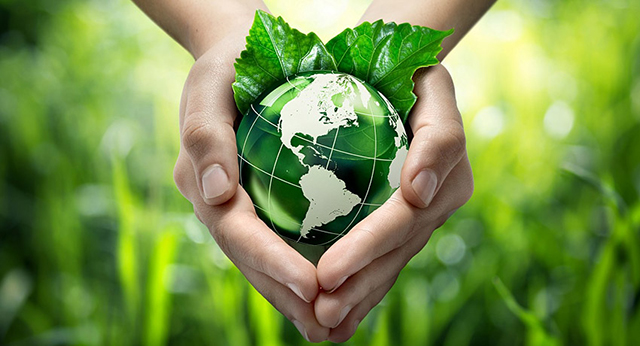

# Informatica Ambiental

## Indice
1. ¿Qué es la contaminación ambiental?
    - [contaminacion](contenido/contaminacion.md)
2. Residuos informáticos
    - [residuos](contenido/residuos.md)
3. Obsolescencia programada 
    - [obsolescencia](contenido/obsolescencia.md)
4. Informática ecológica
    - [informatica_ecologica](contenido/informatica_ecologica.md)
## Referencias

- [Residuos](https://www.fundacionaquae.org/wiki/residuos-electronicos-que-son-y-que-hacer-con-ellos/)

## Autores

## Licencia

This work is licensed under <a href="http://creativecommons.org/licenses/by-nc/4.0/?ref=chooser-v1" target="_blank" rel="license noopener noreferrer" style="display:inline-block;">CC BY-NC 4.0</a>

